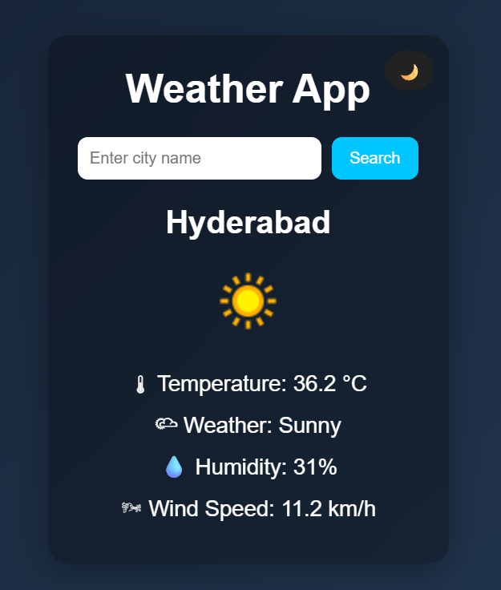
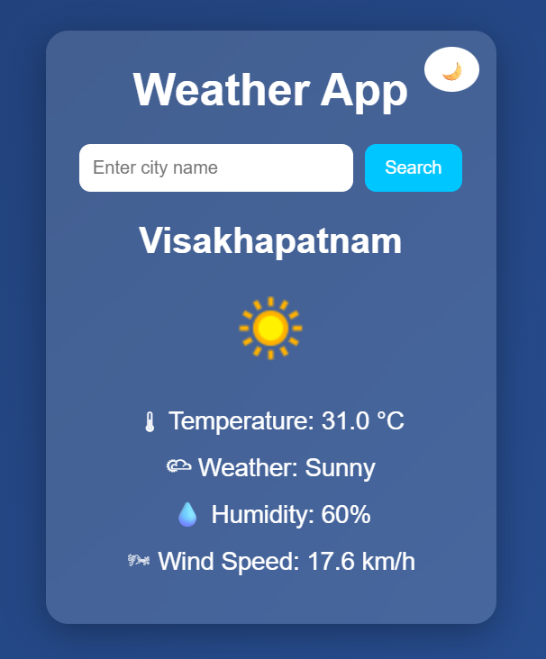
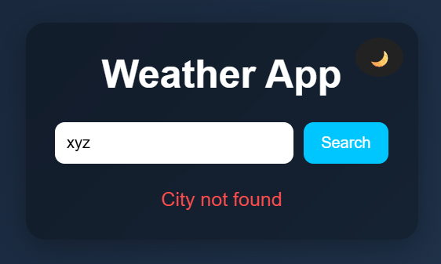

# 🌦 Weather Forecast Website

A modern and responsive weather forecasting web application that provides real-time weather information for any city using WeatherAPI.

This project was built using Python Flask for the backend and HTML, CSS, and JavaScript for the frontend. The application features a clean modern UI, dark mode support, real-time weather data, weather icons, and error handling for invalid city searches.

---

# 🚀 Live Demo

https://weather-app-4g7v.onrender.com

---

# ✨ Features

- 🌍 Search weather by city name
- 🌡 Real-time temperature updates
- 🌥 Live weather condition display
- 💧 Humidity information
- 🌬 Wind speed details
- 🌙 Dark mode toggle
- ❌ Error handling for invalid cities
- 📱 Responsive and modern UI
- 🎨 Glassmorphism design
- ⚡ Fast API integration
- ☁ Real-time weather icons

---

# 🛠 Technologies Used

## Backend
- Python
- Flask

## Frontend
- HTML
- CSS
- JavaScript

## API
- WeatherAPI

## Deployment
- Render

## Version Control
- Git
- GitHub

---

# 📂 Project Structure

```bash
weather-app/
│
├── static/
│   ├── style.css
│   └── script.js
│
├── templates/
│   └── index.html
│
├── home.png
├── weather.png
├── night.png
├── error.png
│
├── app.py
├── requirements.txt
├── Procfile
└── README.md
```

---

# ⚡ Installation and Setup

## Clone the repository

```bash
git clone https://github.com/dhanya-akshaya/weather-app.git
```

---

## Navigate to project folder

```bash
cd weather-app
```

---

## Install required packages

```bash
pip install -r requirements.txt
```

---

## Run the application

```bash
python app.py
```

---

## Open in Browser

```text
http://127.0.0.1:5000
```

---

# 📸 Screenshots

## 🏠 Home Screen


---

## 🌙 Dark Mode



---

## ☀ Weather Details



---

## ❌ Error Handling



---


# 👩‍💻 Developed By

## B.Dhanya Akshaya

Computer Science Student | Python & Web Development Enthusiast
